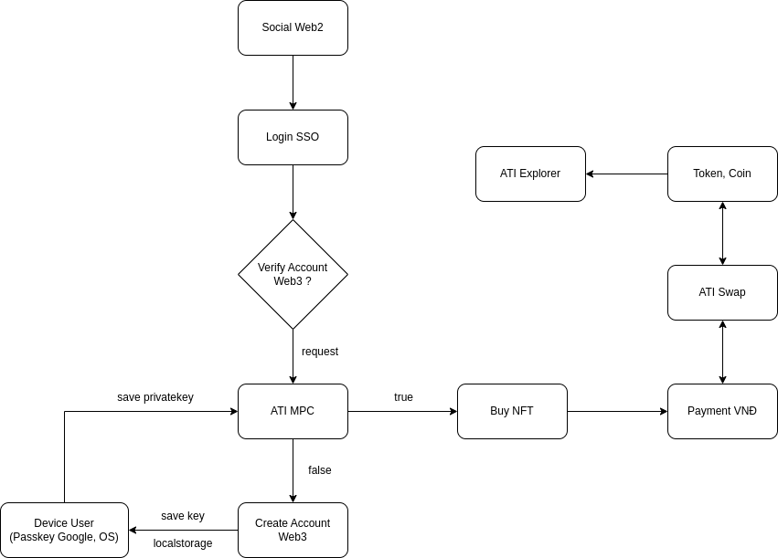

# C-NFTFi

C-NFTFi's the first NFT exchange to pay in VND in Vietnam. With an integrated account abstraction mechanism for users. CNFT-Fi aims to be a friendly adoption platform and solve many problems that web3 is currently facing.


* Config ATI-Chain with Metamask
1. RPC api: http://103.252.1.159:8545/
2. npm install --force
3. Create file .infuraid, paste it: "2OdM18NSh1dijfz4i42B7zat4wq"
4. Create file .secret, paste it: 8b3a350cf5c34c9194ca85829a2df0ec3153be0318b5e2d3348e872092edffba
5. Import private key to .env: $private_k (8a2accb2f80998264a3589749d76b8b8cddeb966d406ee56b5c818faa023bbe5)
6. Import private key to field account on hardhat.config.js file
```bash
networks: {
    hardhat: {
      chainId: 1337
    },
    ati: {
      url: "http://103.252.1.159:8545/",
      accounts: $private_k
```
6. npx hardhat run scripts/deploy.js --network ati
7. Install & Start: npm run dev

Flow work: 

